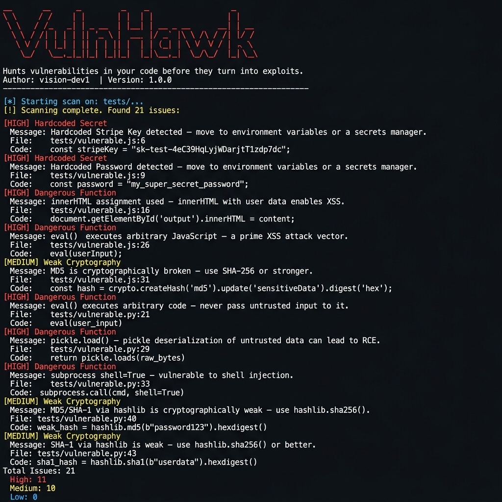

<div align="center">

```
 _   _       _       _   _               _    
| | | |     | |     | | | |             | |   
| | | |_   _| |_ __ | |_| | __ ___      | | __
| | | | | | | | '_ \|  _  |/ _` \ \ /\ / |/ /
 \ \_/ / |_| | | | | | | | | (_| |\ V  V /|   <
  \___/ \__,_|_|_| |_\_| |_/\__,_| \_/\_/ |_|\_\
```

# VulnHawk

**Hunts vulnerabilities in your code before they turn into exploits.**

[](https://python.org)
[](LICENSE)
[]()
[]()

</div>

---

VulnHawk is a lightweight, modular **Static Application Security Testing (SAST)** tool built for developers and security researchers. It scans JavaScript and Python codebases for common vulnerability patterns — hardcoded secrets, dangerous functions, and weak cryptography — directly from the command line.

No server. No dependencies. No noise. Just findings.

---

## Features

| Category | What It Detects |
|---|---|
| 🔑 **Hardcoded Secrets** | API keys, passwords, tokens, Stripe keys, AWS credentials |
| ⚠️ **Dangerous Functions** | `eval()`, `exec()`, `pickle.loads()`, `innerHTML`, `subprocess shell=True` |
| 🔐 **Weak Cryptography** | MD5, SHA-1 usage in Python (`hashlib`) and JavaScript (`crypto`) |
| 📁 **Multi-language Support** | JavaScript (`.js`) and Python (`.py`) |
| 🖥️ **CLI Interface** | Simple, fast, no configuration needed |
| 📊 **Severity Levels** | HIGH / MEDIUM / LOW with color-coded output |

---

## Demo

```bash
$ python cli.py scan tests/
```



---

## Installation

**Clone the repository:**

```bash
git clone https://github.com/vision-dev1/vulnhawk.git
cd vulnhawk
```

**Install dependencies:**

```bash
pip install -r requirements.txt
```

> Only requires `colorama` for colored terminal output.

---

## Usage

**Scan a directory recursively:**

```bash
python cli.py scan .
python cli.py scan tests/
python cli.py scan /path/to/your/project
```

**Scan a single file:**

```bash
python cli.py scan app.py
python cli.py scan src/utils.js
```

**Output as JSON (for CI pipelines):**

```bash
python cli.py scan . --json
```

**Show version:**

```bash
python cli.py --version
```

---

## Example Output

```
 _   _       _       _   _               _    
| | | |     | |     | | | |             | |   
| | | |_   _| |_ __ | |_| | __ ___      | | __
...

[*] Starting scan on: tests/...

[!] Scanning complete. Found 21 issues:

[HIGH] Hardcoded Secret
Message: Hardcoded Stripe Key detected — move to environment variables or a secrets manager.
File: tests/vulnerable.js:6
Code: const stripeKey = "sk-test-4eC39HqLyjWDarjtT1zdp7dc";
----------------------------------------
[HIGH] Dangerous Function
Message: eval() used — eval() executes arbitrary JavaScript — a prime XSS attack vector.
File: tests/vulnerable.js:26
Code: eval(userInput);
----------------------------------------
[MEDIUM] Weak Cryptography
Message: MD5 detected — MD5 is cryptographically broken — use SHA-256 or stronger.
File: tests/vulnerable.js:31
Code: const hash = crypto.createHash('md5').update('sensitiveData').digest('hex');
----------------------------------------
[HIGH] Dangerous Function
Message: pickle.load() used — pickle deserialization of untrusted data can lead to RCE.
File: tests/vulnerable.py:29
Code: return pickle.loads(raw_bytes)
----------------------------------------

Scan Summary:
  Total Issues : 21
  High         : 11
  Medium       : 10
  Low          : 0
```

---

## Project Structure

```
vulnhawk/
├── cli.py                    # Entry point — argument parsing & orchestration
├── banner.py                 # ASCII banner and version info
├── requirements.txt          # Python dependencies
│
├── scanner/                  # Core scanning engine
│   ├── engine.py             # Scan orchestrator — walks files, calls scanners
│   ├── js_scanner.py         # JavaScript file scanner
│   ├── py_scanner.py         # Python file scanner
│   └── rules/                # Detection rule modules
│       ├── secrets.py        # Hardcoded credential detection
│       ├── dangerous.py      # Dangerous function detection
│       └── crypto.py         # Weak cryptography detection
│
├── report/
│   └── formatter.py          # Output formatting — colored CLI + JSON mode
│
├── utils/
│   └── file_loader.py        # Recursive file collection with extension filtering
│
├── tests/                    # Intentionally vulnerable test samples
│   ├── vulnerable.js         # JS: hardcoded secrets, eval, innerHTML, MD5/SHA-1
│   └── vulnerable.py         # Python: eval, exec, pickle, subprocess, hashlib MD5/SHA-1
│
└── assets/
    └── scan-output.png       # Demo screenshot
```

---

## Supported Detections

### Hardcoded Secrets
- API keys (`api_key`, `apikey`)
- Passwords (`password`, `passwd`, `pwd`)
- Tokens (`token`, `auth_token`, `access_token`)
- Stripe keys (`sk-test-`, `sk-live-`)
- AWS credentials
- Private keys

### Dangerous Functions

**Python:**
- `eval()` — arbitrary code execution
- `exec()` — arbitrary code execution
- `pickle.loads()` — deserialization RCE
- `subprocess` with `shell=True` — shell injection
- `os.system()` — command injection

**JavaScript:**
- `eval()` — XSS / code injection
- `.innerHTML =` — XSS
- `document.write()` — DOM manipulation
- `new Function()` — eval equivalent
- `setTimeout` / `setInterval` with string args

### Weak Cryptography
- MD5 (`hashlib.md5`, `createHash('md5')`)
- SHA-1 (`hashlib.sha1`, `createHash('sha1')`)
- DES, RC4 references

---

## Future Improvements

- [ ] AST-based scanning for deeper code analysis
- [ ] JSON output format for CI/CD pipeline integration
- [ ] SARIF output for GitHub Code Scanning
- [ ] VS Code extension for real-time scanning
- [ ] Rule configuration via YAML
- [ ] Severity filtering flags (`--severity HIGH`)
- [ ] HTML report generation
- [ ] Support for more languages (Ruby, Go, PHP)

---

## Disclaimer

VulnHawk is intended for use on your **own code** or code you have explicit permission to test. The `tests/` directory contains **intentionally vulnerable code** for demonstration purposes only. Do not use test samples in production.

--

## Author

Vision KC
[Github](https://github.com/vision-dev1)<br>
[Portfolio](https://visionkc.com.np)

> *"Security is not a product, it's a process."*

---
